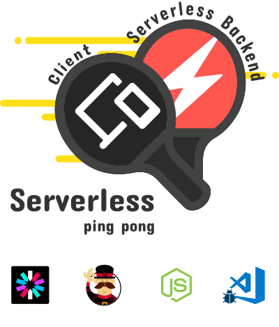

# Serverless RESTful Boilerplate (microservices pattern)

[](http://www.serverless.com)
[](https://packagist.org/packages/frangeris/serverless-boilerplate)

This boilerplate want's to simplify the process of RESTful apis creations under serverless arquitecture in AWS (serverless +v1.x), create a good codebase with scalability while the project grow up could require a lot of efford, time and dedication for know how the framework works, often this process of learning tends to be while we're building the product and this require agility and fast learning, customizing the code could be annoying a take more time than expected, that's the reason of this skeleton. 

## Installation

Clone the project from GitHub and install dependencies:

```sh
$ npm install -g serverless
$ git clone https://github.com/frangeris/serverless-boilerplate.git
$ cd serverless-boilerplate
$ npm install
```

### Boilerplate
The project structure presented in this boilerplate is Microservices Pattern, where functionality is grouped primarily by function rather than resources. Each job or functionality is isolated within a separate Lambda function.

If you wish to read more about this pattern and comparation with others, please check out this awesome [writeup](https://serverless.com/blog/serverless-architecture-code-patterns/) by [Eslam Hefnawy](https://github.com/eahefnawy).

The basic project contains the following directory structure:
```
.
├── serverless.yml
├── README.md
├── package.json
├── .gitignore
├── env.yml.example
├── templates
│   ├── request.vtl
|   └── response.vtl
├── helpers
│   └── index.js
├── functions
│   └── my-resource
│       ├── event.json
│       ├── get.js
│       ├── post.js
│       ├── put.js
│       └── delete.js
└── tests
```

#### Service

Due to the current limitations where every service will create an individual API in API Gateway (WIP), we'll be working with a unique service with all the functions (resources) that will be exposed.

#### serverless.yml
The default provider is `aws`, see [documentation](https://serverless.com/framework/docs/providers/aws/guide/serverless.yml/) for complete list of options available.

#### package.js (required packages)
- [yortus/asyncawait](https://github.com/yortus/asyncawait) for avoid [callback hell](http://callbackhell.com/) in validation helper.
- [krachot/options-resolver](https://github.com/krachot/options-resolver) as port of Symfony component [OptionsResolver](http://symfony.com/doc/current/components/options_resolver.html)
- [HyperBrain/serverless-aws-alias](https://github.com/HyperBrain/serverless-aws-alias) enables use of AWS aliases on Lambda functions.

#### Stages

The default stage is "develop", for create a new on, use the package `serverless-aws-alias` and change the value in `serverless.yml` or pass it as `--option` when deployment.

#### env.yml.example
Environment variables used by your function, variables are grouped by stage, so this meas variables will only be available depending of the stage where you defined them, variables are loaded automatically, there is not need to "require a file early as possible", so copy the file `env.yml.example` to `env.yml` and write the real values, depending the value for `stage` in `serverless.yml` file, values will be loaded, eg: 

Create your final env vars file

```sh
$ cp env.yml.example env.yml
```

Now add the values per stage

```yml
develop:
  AWS_SECRET_KEY: dontsavethiscredentialsstringsincode

prod:
  AWS_SECRET_KEY: dontsavethiscredentialsstringsincode
```

And access them natively in you code from `process.env`:

```javascript
module.exports.handler = (event, context, callback) => {
    console.log(process.env.AWS_SECRET_KEY) // 
}
```

`env.yml.example` is added to VCS for keep reference of the variables, not values. `env.yml` is not uploaded either aws when create the package or vcs.

#### templates
Templates are optionals, used when the integration is `lambda`, this method is more complicated and involves a lot more configuration of the http event syntax, [more info](https://serverless.com/framework/docs/providers/aws/events/apigateway/#lambda-integration).

The templates are defined as plain text, however you can also reference an external file with the help of the `${file(templates/response.vtl)}` syntax, use [Apache Velocity](http://velocity.apache.org/) syntax for custom.  

#### helpers
Helpers are just custom reusable functions for facilitate some repetitive tasks like validations, custom response, etc.

Here the current availables:
- `validate()` this method return a `Promise` and throw an `Error` if the validation fails.
- `response()` is a shorcut for the callback received in the lambda handler, but this add the json body for integration response in API Gateway at the same time, eg:

```javascript
// success response
response() // 200 - {"message": "Request processed successfully"}
response('this works like a charm!') // 200 - {"message": "this works like a charm!"}
response('Oh, you user has been created', 201) // 201 - {"message": "Oh, you user has been created"}

// and the erros
response(new Error('something fails')) // 400 - {"message": "something fails"}
response(new Error('something fails with style'), 500) // 500 - {"message": "something fails with style"}

```

Also `response()` could receive a `body` and `headers` objects for more customization of the response.

```javascript

let headers = {
    "x-custom-header" : "My Header Value"
}

let body = {
    name: 'Jhon Due',
    age: 25,
    company: 'The Company',
    location: 'Somewhere'
}

response('user logged', 200, body, headers)

```

- `resolver` just an `object` to interact with [krachot/options-resolver](https://github.com/krachot/options-resolver)

**For use them it's extremely required add this code at the very begining of the handler**, the reason is that `response` helper use the lambda `callback` function for finish the execution of the lambda and is not cool send it by parameter...

The other issue is related to request body, from [Serverless docs](https://serverless.com/framework/docs/providers/aws/events/apigateway/#simple-http-endpoint) and [AWS Developer Guide](https://docs.aws.amazon.com/apigateway/latest/developerguide/api-gateway-set-up-simple-proxy.html#api-gateway-simple-proxy-for-lambda-input-format):

Note: When the body is a JSON-Document, you must parse it yourself

```json
{
    "resource": "Resource path",
    "path": "Path parameter",
    "httpMethod": "Incoming request's method name"
    "headers": {Incoming request headers}
    "queryStringParameters": {query string parameters }
    "pathParameters":  {path parameters}
    "stageVariables": {Applicable stage variables}
    "requestContext": {Request context, including authorizer-returned key-value pairs}
    "body": "A JSON string of the request payload."
    "isBase64Encoded": "A boolean flag to indicate if the applicable request payload is Base64-encode"
}
```

That means we must to parse the body received, in every functions, is not an object, is an string, so

```javascript
module.exports.handler = (event, context, callback) => {

    // needed for response scope
    global.cb = callback

    // parse the body string to object
    let body = JSON.parse(event.body)

    ...
```

After adding the code bellow, just import the helper lib built-in

```javascript
const { validate, resolver, response } = require('../../helpers')

module.exports.handler = (event, context, callback) => {

    // needed for response scope
    global.cb = callback

    // parse the body string to object
    let body = JSON.parse(event.body)

    // marking as required some parameters
    resolver.setRequired([
        'email',
        'password'
    ])

    // { email: 'tommy@powerrangers.com' }
    validate(event)
        
        // all good!
        .then((body) => console.log('passed!'))
        
        /*
            400 Bad Request
            {"message": "The required options \"password\" are missing"}
        */
        .catch((err) => response(err)) 
}
```

## Development

Install dependencies:

``` bash
npm install
```

## License
This boilerplate is open-sourced software licensed under the [MIT license](http://opensource.org/licenses/MIT)